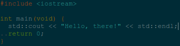
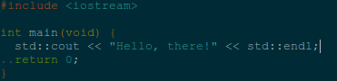

# NinSolarized

A `NeoSolarized` fork with a minor font color change. Make the code easier to read at night.

**Change:**

```diff
-let s:gui_base0       = "#839496"
+let s:gui_base0       = "#adbcc0"
```

**Before:**



**After:**


